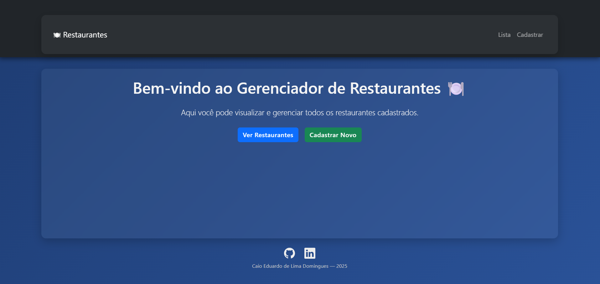

# 🍽️ Gerenciador de Restaurantes

Sistema completo em **React + Node.js + MySQL** para cadastro, edição e visualização de restaurantes.

---

## 🚀 Tecnologias usadas

- ⚛️ React (com React Router, Bootstrap, Toastify)
- 🧠 Node.js + Express
- 🐬 MySQL
- 🎨 CSS customizado com gradientes, animações e responsividade

---

## 📸 Funcionalidades

- ✅ Listar restaurantes
- ✅ Adicionar restaurante com formulário moderno
- ✅ Editar informações no modal
- ✅ Excluir restaurante com confirmação
- ✅ Toasts de feedback visual (sucesso e erro)
- ✅ Interface moderna com página inicial e navegação entre páginas
- ✅ Rodapé com nome e redes sociais do autor

---

## 👨‍💻 Desenvolvedor

Desenvolvido por **Caio Eduardo de Lima Domingues — 2025**

---

## 🖼️ Interface do Sistema

Abaixo uma prévia do projeto em execução:

---

## 🧾 Licença

Projeto acadêmico - uso livre para fins educacionais.
